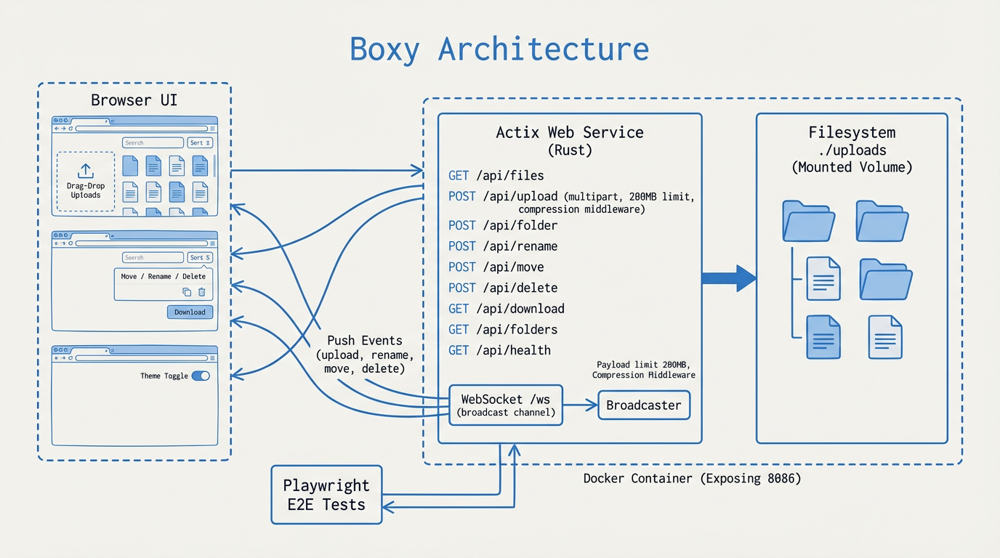

# Boxy

Boxy is a lightweight file sharing UI with real-time updates, drag-and-drop uploads, and basic file management (create, rename, move, delete).

## Features
- Drag-and-drop and clipboard uploads
- Folder navigation, move, rename, delete
- Live updates via WebSocket
- Search and sort client-side

## Architecture

- Browser UI calls REST endpoints for listing, uploads, folder ops, moves, deletes, downloads, and health checks.
- WebSocket /ws fan-out broadcasts upload/rename/move/delete events to active clients.
- Actix Web service reads/writes the `./uploads` filesystem (volume-mountable in Docker).

## Run locally
```bash
cargo run
```
Then open `http://localhost:8086`.

## Endpoints
- `GET /` static UI
- `GET /api/files?path=...` list files
- `POST /api/upload?path=...` upload multipart files
- `POST /api/folder` create folder
- `POST /api/rename` rename item
- `POST /api/move` move item
- `POST /api/delete` delete item
- `GET /api/folders` list folders for move dialog
- `GET /api/download?path=...` download file
- `GET /api/health` healthcheck

## Playwright browser tests
Install dependencies and run the e2e suite:
```bash
npm install
npx playwright install --with-deps
npm run test:e2e
```

If the server is already running, Playwright will reuse it.

## Docker
Build and run:
```bash
docker build -t boxy .
docker run -p 8086:8086 -v $(pwd)/uploads:/app/uploads boxy
```

Or with compose:
```bash
docker compose up --build
```
