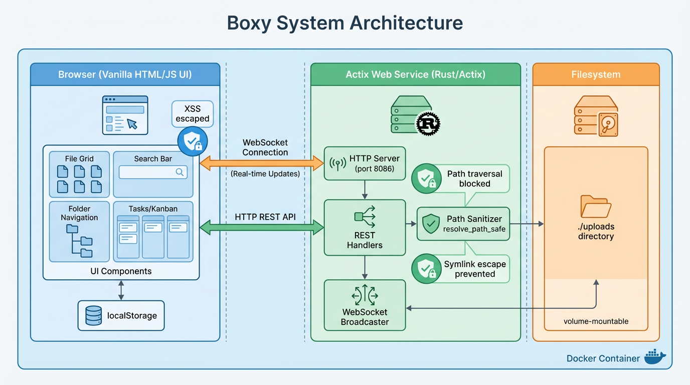
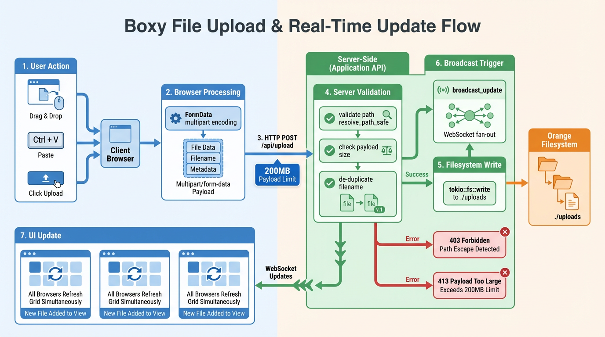

# Boxy

Boxy is a lightweight file sharing UI with real-time updates, drag-and-drop uploads, and basic file management (create, rename, move, delete). Rust/Actix backend, static HTML frontend, WebSocket fan-out for live events.

## Features
- Drag-and-drop, clipboard paste, and folder uploads
- Folder navigation, move, rename, delete
- Multi-select with Ctrl/Cmd+click, Shift+click, bulk operations
- Live updates via WebSocket
- Global search across all files (recursive)
- File type filtering (All, Images, Documents, Code, Audio/Video)
- Grid/list view toggle with persistent preference
- Image thumbnails with lazy loading in both views
- Sortable table columns in list view (Name, Type, Size, Date Modified)
- Keyboard navigation (arrows, space, enter, backspace, escape)
- Preserved original file modification dates on upload
- Tasks/Kanban boards for project management

### Tasks Feature Persistence
Tasks and boards are stored in **browser localStorage only** (no server persistence). Clearing browser data or switching browsers will reset all tasks.

### Claude Code Skills
Repo includes Claude Code skills under `.claude/skills/` for development guidance.

## Architecture & Flow

Boxy uses a simple three-layer architecture:

| Layer | Technology | Responsibility |
|-------|------------|----------------|
| **Client** | Vanilla HTML/JS | UI, local state (tasks in localStorage) |
| **Server** | Rust/Actix | REST API, WebSocket broadcast, path sanitization |
| **Storage** | Local filesystem | `./uploads` directory (volume-mountable) |



### WebSocket Real-time Model

All file mutations (upload, rename, move, delete, edit) trigger a broadcast to connected clients:

```
Client A: POST /api/rename → Server → broadcast_update("rename", path)
                                   ↓
                              WebSocket fan-out
                                   ↓
Client B, C, D: receive { action: "rename", path: "..." } → refresh grid
```

Reconnection uses a fixed 2-second retry interval via `connectWS()`.



### Security Invariants

| Invariant | Implementation | Purpose |
|-----------|----------------|---------|
| **Path traversal blocked** | `resolve_path_safe()` with canonicalization | Prevents `../` escapes and symlink attacks |
| **Search DoS prevention** | `MAX_SEARCH_RESULTS = 100` | Caps recursive search to prevent runaway traversal |
| **XSS prevention** | `escapeHtml()` / `escapeAttr()` | All user content escaped before innerHTML |
| **Payload limit** | 200MB default (`BOX_MAX_UPLOAD_BYTES`) | Prevents memory exhaustion |

See `docs/ARCHITECTURE.md` for full details.

## Docs
- Architecture details: `docs/ARCHITECTURE.md`
- UI walkthrough with screenshots: `docs/UI_WALKTHROUGH.md`

## Run locally
```bash
BOX_PORT=8086              # HTTP port (default 8086)
BOX_UPLOAD_DIR=./uploads   # upload root (default ./uploads)
BOX_MAX_UPLOAD_BYTES=209715200  # max upload size in bytes (default 200MB)
cargo run
```
Then open `http://localhost:8086` (or your overridden port).

## Endpoints

| Method | Path | Description |
|--------|------|-------------|
| GET | `/` | Static UI (SPA) |
| GET | `/ws` | WebSocket for live updates |
| GET | `/api/files?path=...` | List files in directory |
| GET | `/api/search?q=...` | Search files recursively (max 100 results) |
| POST | `/api/upload?path=...` | Upload multipart files (supports nested paths) |
| POST | `/api/folder` | Create folder `{ name, path? }` |
| POST | `/api/rename` | Rename item `{ path, new_name }` |
| POST | `/api/move` | Move item `{ path, dest_dir? }` |
| POST | `/api/delete` | Delete item `{ path }` |
| GET | `/api/folders` | List all folders (for move dialog) |
| GET | `/api/download?path=...` | Download/preview file |
| GET | `/api/content?path=...` | Get file content (text files only) |
| POST | `/api/content` | Save file content `{ path, content }` |
| POST | `/api/newfile` | Create new file `{ path?, filename }` |
| GET | `/api/health` | Healthcheck |

## Playwright browser tests
Install dependencies and run the e2e suite:
```bash
npm install
npx playwright install --with-deps
npm run test:e2e
```

If the server is already running, Playwright will reuse it.

## Docker
Build and run:
```bash
docker build -t boxy .
docker run -p 8086:8086 -v $(pwd)/uploads:/app/uploads boxy
```

Or with compose:
```bash
docker compose up --build
```

## Diagram Generation

Architecture diagrams are generated using AI image tools (g3img, DALL-E, etc.) with reproducible prompts stored in `docs/prompts/`:

| Diagram | Prompt File | Description |
|---------|-------------|-------------|
| System Architecture | `01-system-architecture.md` | Three-layer architecture with Docker boundary |
| File Upload Flow | `02-file-upload-flow.md` | Upload cycle with broadcast and error paths |
| Request Lifecycle | `03-request-lifecycle.md` | Sequence diagram for rename operation |
| WebSocket Model | `04-websocket-model.md` | Fan-out topology and reconnection behavior |
| Security Model | `05-security-model.md` | Defense-in-depth layers and threat mitigation |
| UI Feature Map | `06-ui-feature-map.md` | Frontend capabilities overview |
| Deployment View | `07-deployment-view.md` | Containerized deployment architecture |

Generated images are saved to `docs/assets/images/` with date suffixes (e.g., `boxy-system-architecture-20260118.png`).
