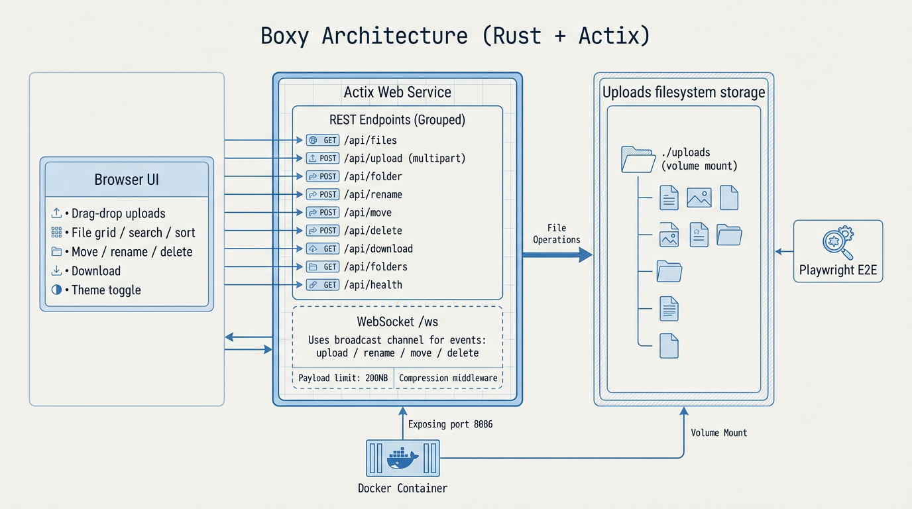
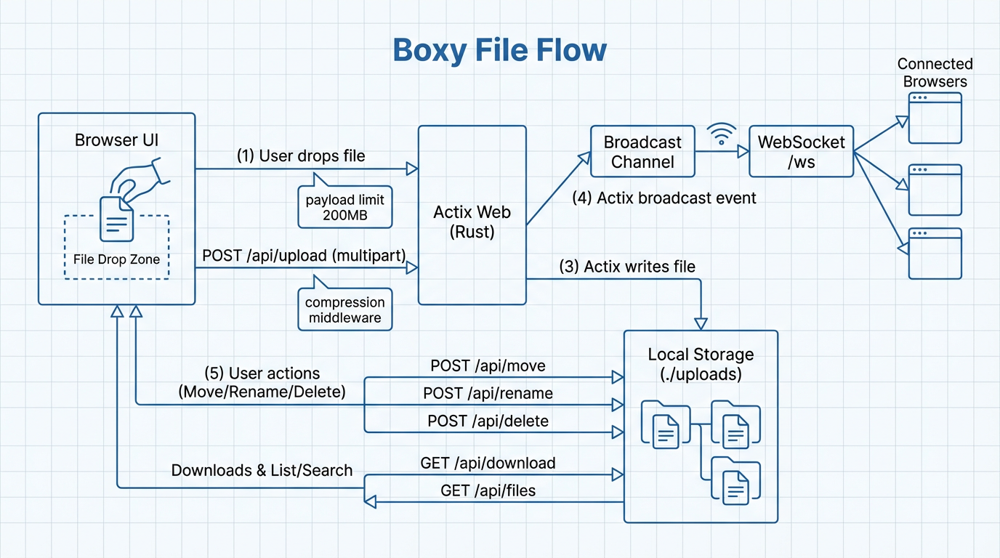
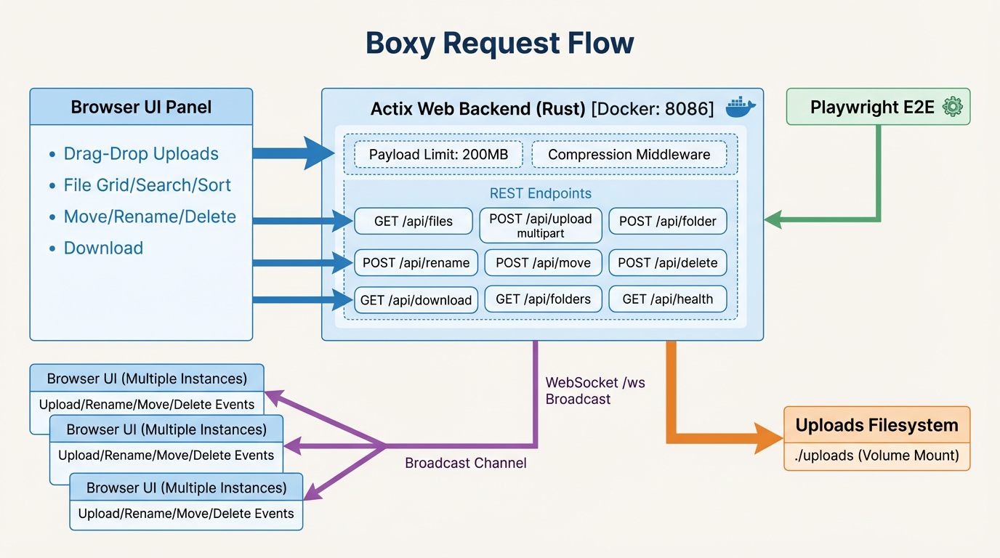

# Boxy

Boxy is a lightweight file sharing UI with real-time updates, drag-and-drop uploads, and basic file management (create, rename, move, delete). Rust/Actix backend, static HTML frontend, WebSocket fan-out for live events.

## Features
- Drag-and-drop, clipboard paste, and folder uploads
- Folder navigation, move, rename, delete
- Multi-select with Ctrl/Cmd+click, Shift+click, bulk operations
- Live updates via WebSocket
- Global search across all files (recursive)
- File type filtering (All, Images, Documents, Code, Audio/Video)
- Grid/list view toggle with persistent preference
- Image thumbnails with lazy loading in both views
- Sortable table columns in list view (Name, Type, Size, Date Modified)
- Keyboard navigation (arrows, space, enter, backspace, escape)
- Preserved original file modification dates on upload
- Tasks/Kanban boards for project management

### Tasks Feature Persistence
Tasks and boards are stored in **browser localStorage only** (no server persistence). Clearing browser data or switching browsers will reset all tasks.

### Claude Code Skills
Repo includes Claude Code skills under `.claude/skills/` for development guidance.

## Architecture & flow


- 
- Browser UI calls REST endpoints for listing, uploads, folder ops, moves, deletes, downloads, and health checks.
- WebSocket `/ws` fan-out broadcasts upload/rename/move/delete events to active clients.
- Actix Web service reads/writes the `./uploads` filesystem (volume-mountable in Docker). See `docs/ARCHITECTURE.md` for details.

## Docs
- UI walkthrough with live screenshots: `docs/UI_WALKTHROUGH.md`

## Run locally
```bash
BOX_PORT=8086              # HTTP port (default 8086)
BOX_UPLOAD_DIR=./uploads   # upload root (default ./uploads)
BOX_MAX_UPLOAD_BYTES=209715200  # max upload size in bytes (default 200MB)
cargo run
```
Then open `http://localhost:8086` (or your overridden port).

## Endpoints
- `GET /` static UI
- `GET /ws` WebSocket for live updates
- `GET /api/files?path=...` list files
- `GET /api/search?q=...` search all files recursively
- `POST /api/upload?path=...` upload multipart files (supports nested paths for folders)
- `POST /api/folder` create folder
- `POST /api/rename` rename item
- `POST /api/move` move item
- `POST /api/delete` delete item
- `GET /api/folders` list folders for move dialog
- `GET /api/download?path=...` download/preview file
- `GET /api/health` healthcheck

## Playwright browser tests
Install dependencies and run the e2e suite:
```bash
npm install
npx playwright install --with-deps
npm run test:e2e
```

If the server is already running, Playwright will reuse it.

## Docker
Build and run:
```bash
docker build -t boxy .
docker run -p 8086:8086 -v $(pwd)/uploads:/app/uploads boxy
```

Or with compose:
```bash
docker compose up --build
```
