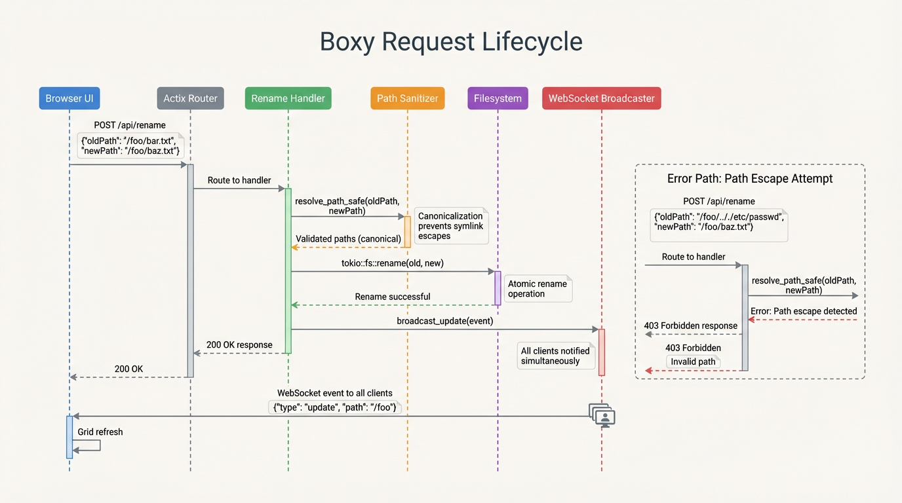
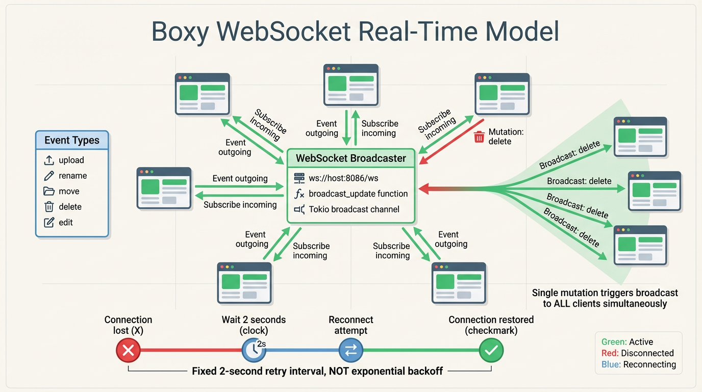
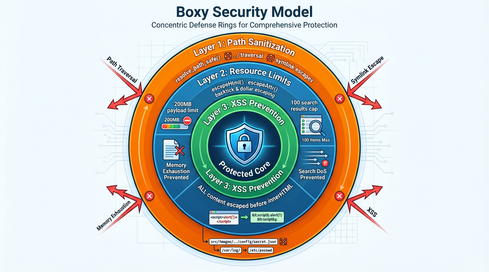
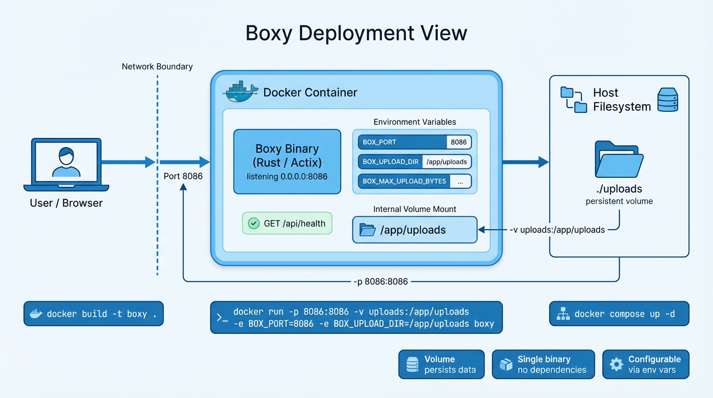

# Boxy Architecture

## Overview

Boxy is a lightweight file sharing UI built with Rust/Actix, serving a static web client and REST/WebSocket APIs for file operations backed by a local uploads directory.

### Core Components

| Component | Technology | Purpose |
|-----------|------------|---------|
| **Frontend** | Vanilla HTML/JS | Single-page UI with drag-drop, search, file grid |
| **Backend** | Rust + Actix Web | REST API, WebSocket broadcast, path sanitization |
| **Storage** | Local filesystem | `./uploads` directory (volume-mountable in Docker) |

### Key Characteristics

- **Web UI**: drag-drop uploads, file grid with search/sort, move/rename/delete, downloads, theme toggle
- **APIs**: REST endpoints for file CRUD; WebSocket `/ws` for broadcast updates
- **Storage**: local filesystem with server-side filename de-duplication
- **Limits**: 200MB payload limit, 100 search results cap
- **Config**: runtime environment variables (`BOX_PORT`, `BOX_UPLOAD_DIR`, `BOX_MAX_UPLOAD_BYTES`)

## Diagrams

### System Architecture

Three-layer architecture: Browser (vanilla HTML/JS) ↔ Actix Server (Rust) ↔ Filesystem (./uploads). All layers enclosed in optional Docker container with port 8086 exposed and uploads volume mounted.

### File Upload & Real-Time Update Flow

1. User drags file → 2. Browser packages multipart FormData → 3. POST /api/upload → 4. Server validates path & size → 5. Write to filesystem → 6. broadcast_update() → 7. All clients refresh grid.

### Request Lifecycle (Rename Example)

Sequence: Browser → Actix Router → Handler → Path Sanitizer (`resolve_path_safe`) → Filesystem (`tokio::fs::rename`) → WebSocket Broadcaster → All clients receive event.

### WebSocket Model

Hub-and-spoke fan-out topology. Fixed 2-second reconnect interval (NOT exponential backoff). Events: upload, rename, move, delete, edit.

### Security Model

Defense-in-depth: Layer 1 (Path Sanitization) → Layer 2 (Resource Limits) → Layer 3 (Output Encoding). Blocks path traversal, symlink escapes, DoS, and XSS.

### Deployment View

Docker container exposing port 8086, volume mount for persistent uploads, configurable via environment variables.

## Security Architecture

### Path Sanitization
All filesystem operations pass through `resolve_path_safe()`:
- Canonicalizes paths to resolve symlinks
- Validates result is within configured upload root
- Blocks `../` traversal attempts
- Returns `None` for any escape attempt (results in 403)

### Resource Limits
- **Payload limit**: 200MB (`BOX_MAX_UPLOAD_BYTES`) prevents memory exhaustion
- **Search cap**: 100 results (`MAX_SEARCH_RESULTS`) prevents recursive traversal DoS

### Output Encoding
- `escapeHtml()`: Escapes `<`, `>`, `&`, `"`, `'` for HTML content
- `escapeAttr()`: Additional escaping for backtick `` ` `` and `$` (template literal injection prevention)
- All user-provided content escaped before `innerHTML` assignment

## Runtime Configuration

| Variable | Default | Description |
|----------|---------|-------------|
| `BOX_PORT` | `8086` | HTTP bind port |
| `BOX_UPLOAD_DIR` | `./uploads` | Upload root directory |
| `BOX_MAX_UPLOAD_BYTES` | `209715200` | Max upload size (200MB) |

## API Surface

| Method | Endpoint | Description |
|--------|----------|-------------|
| GET | `/` | Static UI (SPA) |
| GET | `/ws` | WebSocket broadcast channel |
| GET | `/api/files?path=...` | List items in folder |
| GET | `/api/search?q=...` | Recursive file search (max 100 results) |
| POST | `/api/upload?path=...` | Multipart upload (supports nested paths) |
| POST | `/api/folder` | Create folder `{ name, path? }` |
| POST | `/api/rename` | Rename `{ path, new_name }` |
| POST | `/api/move` | Move `{ path, dest_dir? }` |
| POST | `/api/delete` | Delete `{ path }` |
| GET | `/api/folders` | List all folders (for move dialog) |
| GET | `/api/download?path=...` | Download/preview file |
| GET | `/api/content?path=...` | Get file content (text files only) |
| POST | `/api/content` | Save file content `{ path, content }` |
| POST | `/api/newfile` | Create new file `{ path?, filename }` |
| GET | `/api/health` | Healthcheck |

## WebSocket Events

All file mutations trigger `broadcast_update(action, path)`:

| Action | Trigger | Payload |
|--------|---------|---------|
| `upload` | File uploaded | `{ action, path }` |
| `rename` | File/folder renamed | `{ action, path, new_name }` |
| `move` | File/folder moved | `{ action, path, dest }` |
| `delete` | File/folder deleted | `{ action, path }` |
| `edit` | File content saved | `{ action, path }` |

Reconnection: Fixed 2-second retry interval via `setTimeout(connectWS, 2000)`.

## Implementation Notes

- Paths are sanitized and resolved under the configured upload root to prevent traversal
- Duplicate filenames are de-duped server-side (`name`, `name_1`, `name_2`, ...)
- Broadcast channel fans out events to all connected WebSocket clients
- Compression middleware and payload limits protect the service
- Tasks/Kanban feature uses browser localStorage only (no server persistence)
