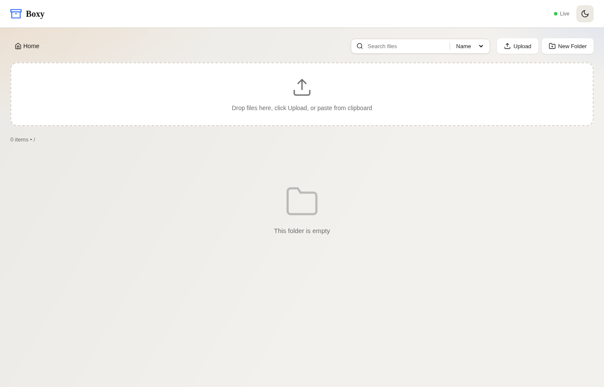
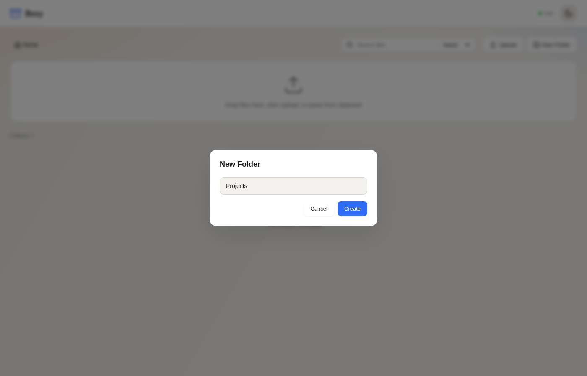
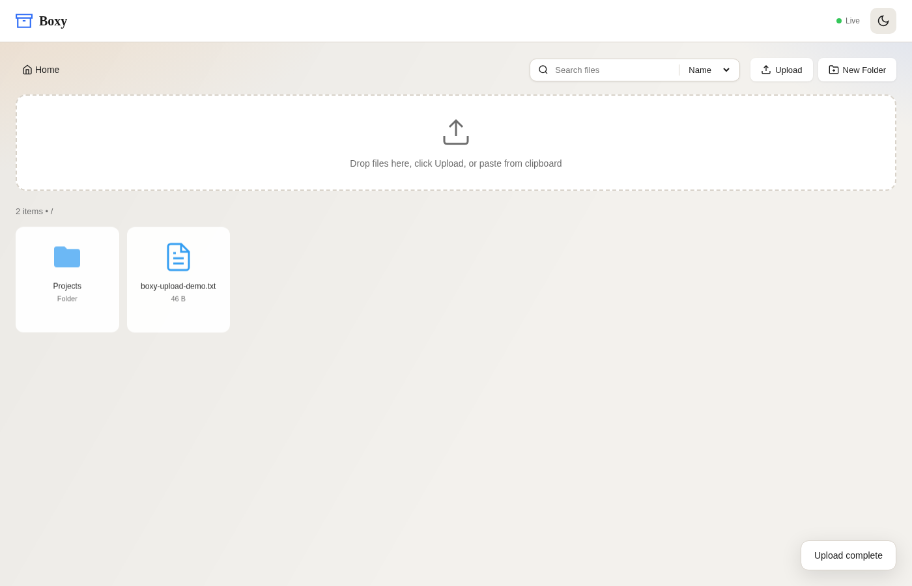
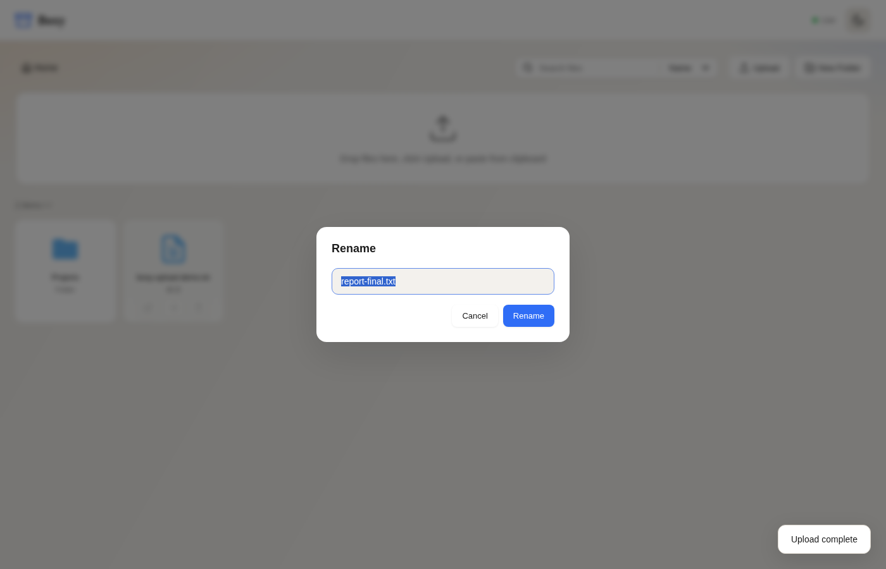
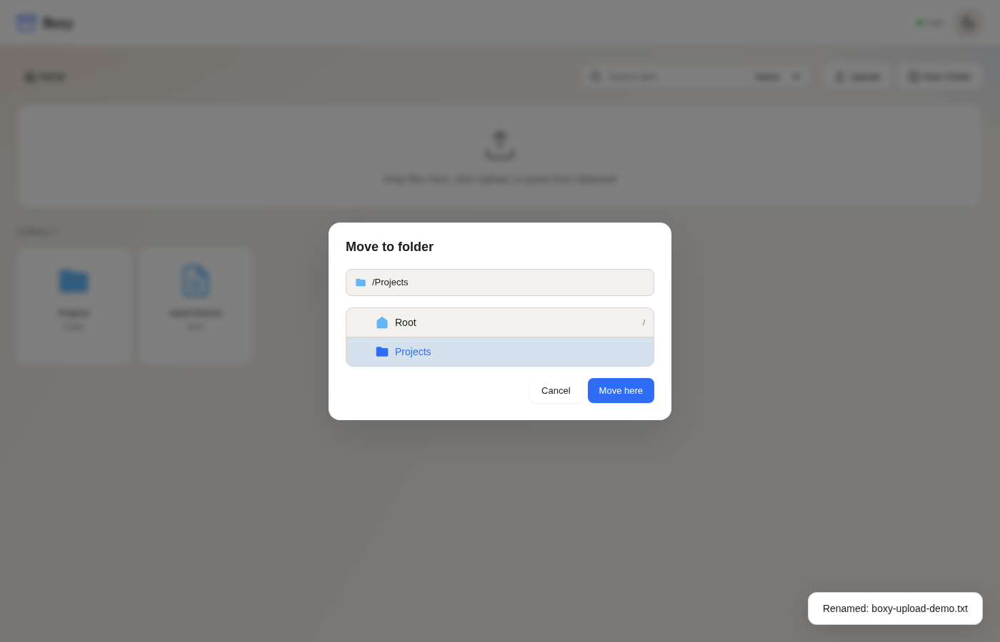
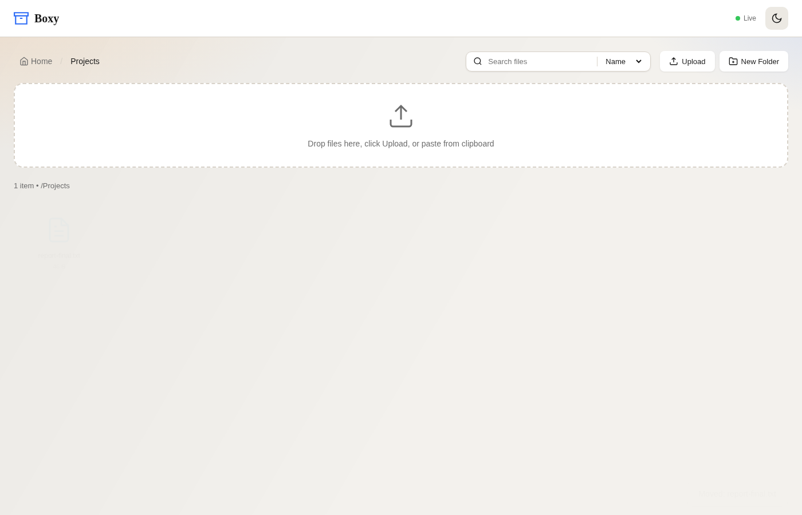

# Boxy UI Walkthrough (Screenshots)

Captured on 2026-01-12 against a local build (`BOX_UPLOAD_DIR=./uploads_docs`, `BOX_PORT=8086`) using Playwright + Chromium. Each screenshot shows the live UI performing a core action.

## 1) Home screen

- Empty state with drop zone, toolbar, search/sort controls, and breadcrumb.

## 2) Create a folder

- `New Folder` opens a modal; entering `Projects` and clicking `Create` adds the folder to the grid.

## 3) Upload a file

- File selected via the hidden file picker (`#fileInput`); progress bar runs, and the new file card appears with metadata.

## 4) Rename a file

- Hover a file card to reveal actions, click `Rename`, edit the name, and confirm to update the listing.

## 5) Move a file

- Hover the file, choose `Move`, select destination (e.g., `Projects`) in the tree, then click `Move here`.

## 6) Folder view after move

- Navigating into `Projects` shows the moved file (`report-final.txt`), verifying the move.

## Reproducing screenshots
1) Start the server with a clean uploads root:
   ```bash
   BOX_UPLOAD_DIR=./uploads_docs BOX_PORT=8086 cargo run --release
   ```
2) In another shell, install dependencies once:
   ```bash
   npm install
   npx playwright install --with-deps chromium
   ```
3) Run a Playwright capture script similar to:
   ```bash
   node - <<'NODE'
   const { chromium } = require('playwright');
   const fs = require('fs');
   const path = require('path');
   const imagesDir = path.join(process.cwd(), 'docs/assets/images');
   if (!fs.existsSync(imagesDir)) fs.mkdirSync(imagesDir, { recursive: true });
   const stamp = '20260112';
   const imgPath = (slug) => path.join(imagesDir, `boxy-${slug}-${stamp}.png`);
   (async () => {
     const browser = await chromium.launch({ headless: true });
     const page = await browser.newPage({ viewport: { width: 1400, height: 900 } });
     const base = 'http://localhost:8086';
     await page.goto(base, { waitUntil: 'networkidle' });
     await page.waitForSelector('text=Drop files here');
     await page.screenshot({ path: imgPath('ui-home'), fullPage: true });
     await page.getByRole('button', { name: 'New Folder' }).click();
     await page.fill('#folderName', 'Projects');
     await page.waitForSelector('#folderModal.active');
     await page.screenshot({ path: imgPath('ui-new-folder'), fullPage: true });
     await page.getByRole('button', { name: 'Create' }).click();
     await page.waitForSelector('text=Projects');
     const uploadPath = path.join('/tmp', 'boxy-upload-demo.txt');
     fs.writeFileSync(uploadPath, 'Demo upload from automated documentation run.\n');
     await page.setInputFiles('#fileInput', uploadPath);
     await page.waitForSelector('text=boxy-upload-demo.txt', { timeout: 5000 });
     await page.waitForTimeout(300);
     await page.screenshot({ path: imgPath('ui-uploaded'), fullPage: true });
     const fileCard = page.locator('.file-item', { hasText: 'boxy-upload-demo.txt' }).first();
     await fileCard.hover();
     await fileCard.locator('button[title="Rename"]').click();
     await page.fill('#renameName', 'report-final.txt');
     await page.waitForSelector('#renameModal.active');
     await page.screenshot({ path: imgPath('ui-rename-modal'), fullPage: true });
     await page.locator('#renameModal').getByRole('button', { name: 'Rename' }).click();
     await page.waitForSelector('text=report-final.txt');
     const renamedCard = page.locator('.file-item', { hasText: 'report-final.txt' }).first();
     await renamedCard.hover();
     await renamedCard.locator('button[title="Move"]').click();
     await page.waitForSelector('#moveModal.active');
     await page.locator('#moveModal .tree-folder-name', { hasText: 'Projects' }).click();
     await page.waitForTimeout(200);
     await page.screenshot({ path: imgPath('ui-move-modal'), fullPage: true });
     await page.locator('#moveModal').getByRole('button', { name: 'Move here' }).click();
     await page.waitForTimeout(500);
     await page.locator('.file-item', { hasText: 'Projects' }).click();
     await page.waitForSelector('.file-item:has-text("report-final.txt")');
     await page.screenshot({ path: imgPath('ui-folder-view'), fullPage: true });
     await browser.close();
   })();
   NODE
   ```
   Adjust the `stamp` to roll new filenames as needed.
