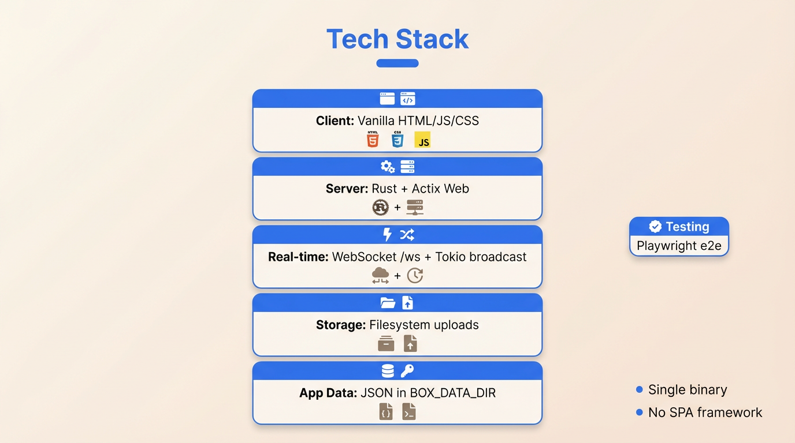
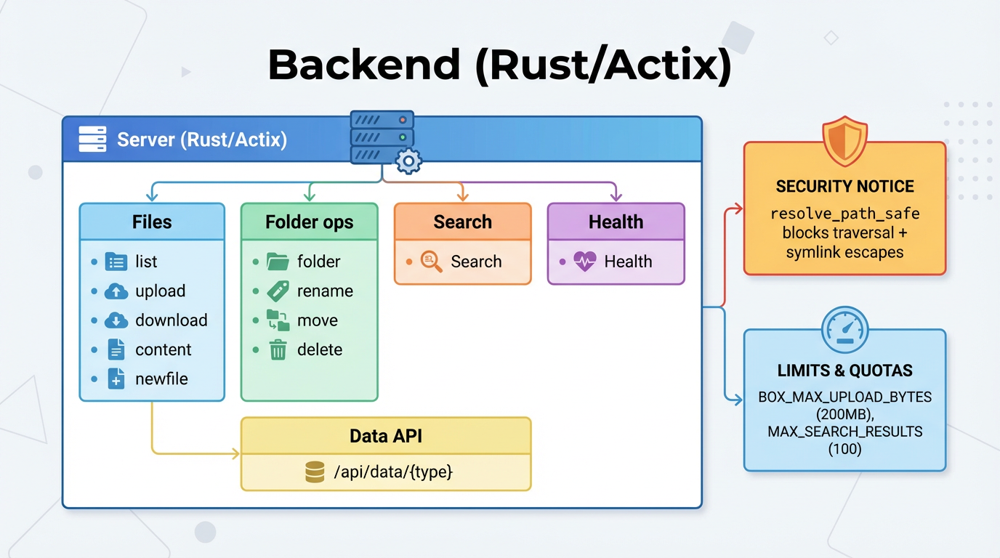
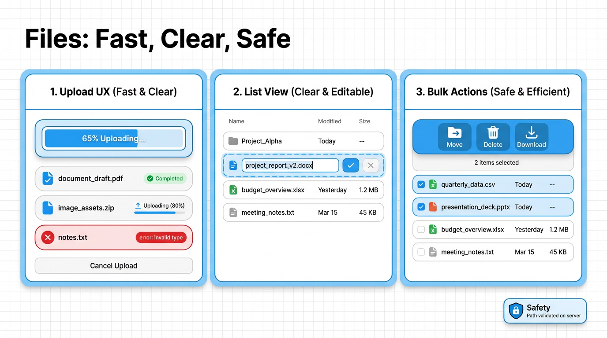

# Boxy Presentation 3.0 (Markdown)

This Markdown version renders all slides directly in GitHub.

- PDF: `boxy-presentation-3.0.pdf`

---

## 01 — Title

## 02 — Overview

## 03 — Stack

## 04 — Frontend

## 05 — Backend

## 06 — API

## 07 — Real-time

## 08 — File Features

## 09 — Productivity

## 10 — Security

## 11 — Testing

## 12 — Deployment

