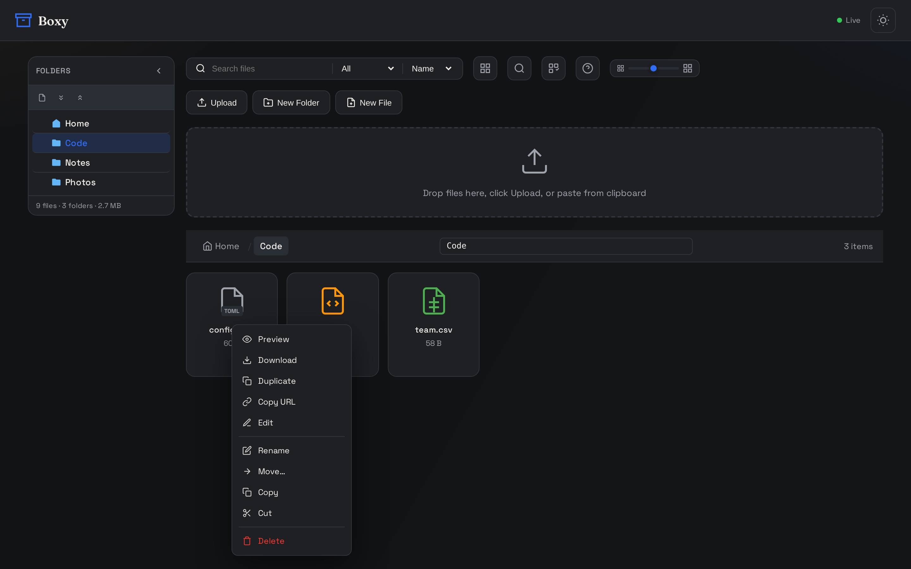
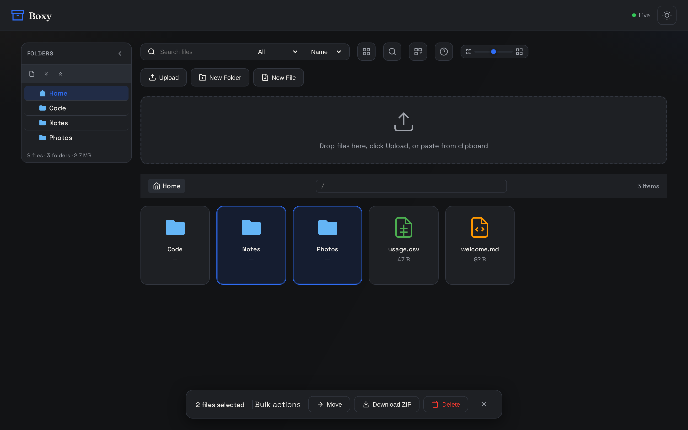
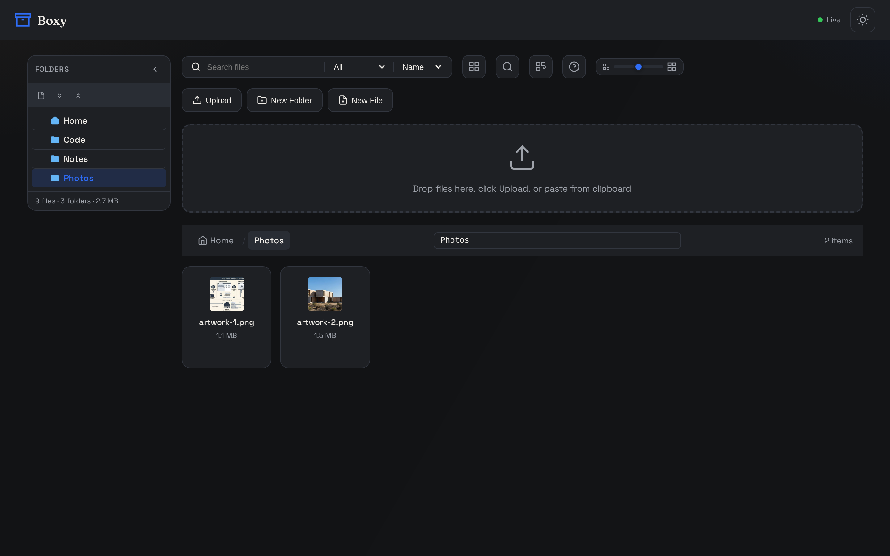

## Uploading

Three ways in, all landing in the **current folder**:

- **Drag and drop** — drop files or whole folders anywhere on the window; nested folder
  structure and original modification dates are preserved.
- **Clipboard paste** — paste files or images directly.
- **Upload button** — the classic file picker.

Name collisions never overwrite: the server de-duplicates automatically
(`name`, `name_1`, `name_2`, … with a UUID fallback).

From the command line or your own tooling:

<Tabs>
  <Tab title="cURL" language="curl">
    ```bash
    # Upload into the docs/ folder (created if missing)
    curl -s -F "file=@report.pdf" "https://api.boxy.bjk.ai/api/upload?path=docs"
    # ["report.pdf"]
    ```
  </Tab>
  <Tab title="Python" language="python">
    ```python
    import requests

    with open("report.pdf", "rb") as f:
        r = requests.post(
            "https://api.boxy.bjk.ai/api/upload",
            params={"path": "docs"},
            files={"file": f},
        )
    print(r.json())  # ["report.pdf"]
    ```
  </Tab>
  <Tab title="JavaScript" language="javascript">
    ```javascript
    const form = new FormData();
    form.append("file", fileInput.files[0]);

    const res = await fetch("https://api.boxy.bjk.ai/api/upload?path=docs", {
      method: "POST",
      body: form,
    });
    console.log(await res.json()); // ["report.pdf"]
    ```
  </Tab>
</Tabs>

## Folders & moving around

<Frame caption="Grid view — sidebar folder tree, breadcrumbs, editable path bar, and live storage totals">
  
</Frame>

- Create folders from the toolbar or the right-click context menu.
- Navigate via breadcrumbs, the **collapsible sidebar folder tree**, or the **editable
  path bar** (type a path, press <kbd>Enter</kbd>).
- The current folder is reflected in the **URL hash**, so folder locations are linkable.
- The sidebar footer shows **live storage totals** (files · folders · size) for the root.

## The context menu

Right-click any file or folder for the full action set — Preview, Download, Copy URL,
Edit, Rename, Move, Copy, Cut, Paste, Duplicate, and Delete:

<Frame caption="Right-click context menu on a file">
  
</Frame>

- **Clipboard** — <kbd>Ctrl/⌘ C</kbd> copy, <kbd>Ctrl/⌘ X</kbd> cut, <kbd>Ctrl/⌘ V</kbd>
  paste, on single items or multi-selections. Cut items dim until pasted.
- **Drag and drop** — drop items onto a folder card or onto the sidebar tree to move them.
- **Inline rename** — <kbd>F2</kbd> or the context menu; edit the name in place.

## Multi-select & bulk actions

Select with <kbd>Ctrl/⌘ click</kbd>, <kbd>Shift click</kbd> for ranges, or flip on
**multi-select mode** in the toolbar for single-click selection.

<Frame caption="The selection bar offers bulk Move, ZIP download, and Delete">
  
</Frame>

## Image thumbnails & lightbox

Grid tiles for images load cached 320 px JPEG thumbnails from the server — not full-size
originals — lazily, with skeleton shimmer placeholders while a folder loads. Double-click
any image for a full-screen lightbox with keyboard arrow navigation.

<Frame caption="Server-side thumbnails in the Photos folder">
  
</Frame>

## Downloads

| What | In the UI | Via the API |
|------|-----------|-------------|
| Single file | Context menu → Download | `GET /api/download?path=…&download=true` |
| Inline preview | Click the file | `GET /api/download?path=…` |
| Whole folder as ZIP | Folder context menu | `GET /api/download-zip?path=…` |
| Any selection as ZIP | Selection bar → ZIP | `POST /api/download-zip-multi` |

```bash
# Grab an entire folder as a ZIP archive
curl -sOJ "https://api.boxy.bjk.ai/api/download-zip?path=docs"
```

<Warning>
Deletion is **permanent** — there is no trash. Folder deletion is recursive.
</Warning>
