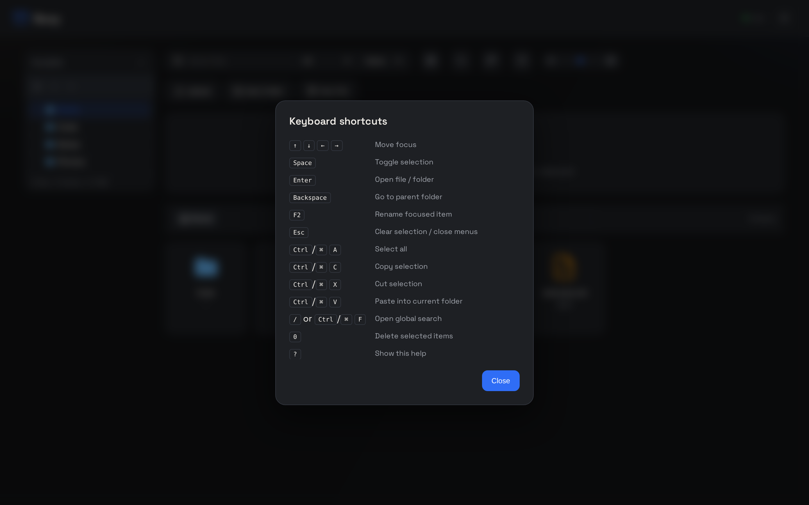

<Frame caption="The in-app shortcuts reference — press ? anywhere">
  
</Frame>

## Browser

| Shortcut | Action |
|----------|--------|
| <kbd>↑</kbd> <kbd>↓</kbd> <kbd>←</kbd> <kbd>→</kbd> | Move focus between items |
| <kbd>Space</kbd> | Toggle selection of the focused item |
| <kbd>Enter</kbd> | Open the focused file / folder |
| <kbd>Backspace</kbd> | Go to the parent folder |
| <kbd>F2</kbd> | Rename the focused item |
| <kbd>Esc</kbd> | Clear selection / close menus |
| <kbd>Ctrl/⌘ A</kbd> | Select all |
| <kbd>Ctrl/⌘ C</kbd> | Copy selection to clipboard |
| <kbd>Ctrl/⌘ X</kbd> | Cut selection (items dim until pasted) |
| <kbd>Ctrl/⌘ V</kbd> | Paste into the current folder |
| <kbd>/</kbd> or <kbd>Ctrl/⌘ F</kbd> | Open global search |
| <kbd>0</kbd> | Delete selected items |
| <kbd>?</kbd> | Show the shortcuts modal |

## Editor

| Shortcut | Action |
|----------|--------|
| <kbd>Ctrl/⌘ S</kbd> | Save immediately (autosave also runs on a 2-second debounce) |
| <kbd>Esc</kbd> | Close the editor |

## Lightbox

| Shortcut | Action |
|----------|--------|
| <kbd>←</kbd> <kbd>→</kbd> | Previous / next image |
| <kbd>Esc</kbd> | Close the lightbox |

<Tip>
Selection basics: <kbd>Ctrl/⌘ click</kbd> toggles individual items, <kbd>Shift click</kbd>
selects a range, and the toolbar's multi-select mode enables single-click selection.
</Tip>
