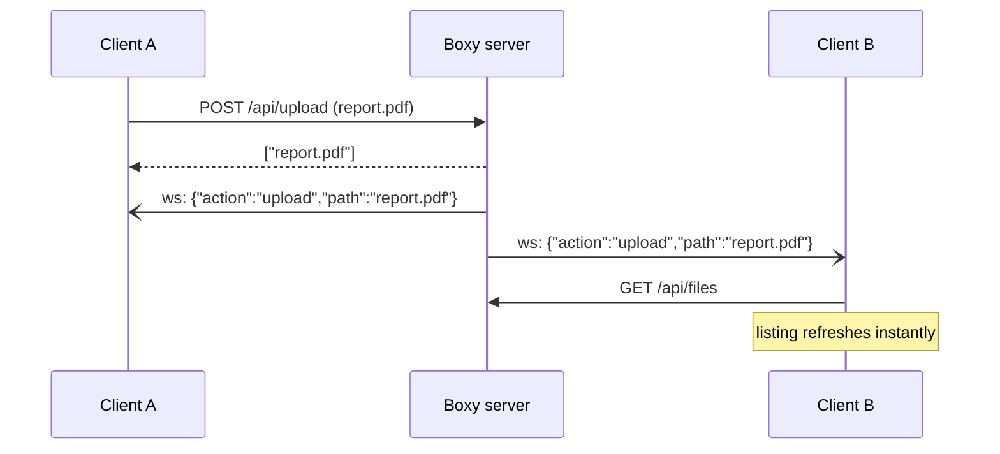

Boxy keeps all open browser tabs in sync. When any client uploads, renames, moves,
deletes, edits, or copies something, **every** connected client updates immediately — no
polling, no manual refresh.

## How it works



1. On load, the frontend opens a WebSocket to `wss://boxy.bjk.ai/ws`.
2. Each connection subscribes to a server-side `tokio::sync::broadcast` channel.
3. Every mutating API handler publishes a small JSON event after it succeeds.
4. Clients receiving an event refresh the affected views (file listing, sidebar tree,
   storage footer).

The full list of actions and what each one's `path` means is on the
[WebSocket Events](/documentation/reference/web-socket-events) reference page.

## Consume the stream yourself

<Tabs>
  <Tab title="CLI" language="curl">
    ```bash
    npx wscat -c wss://api.boxy.bjk.ai/ws
    # < {"action":"upload","path":"docs/report.pdf"}
    # < {"action":"delete","path":"old-draft.md"}
    ```
  </Tab>
  <Tab title="JavaScript" language="javascript">
    ```javascript
    const ws = new WebSocket("wss://api.boxy.bjk.ai/ws");
    ws.onmessage = (e) => {
      const { action, path } = JSON.parse(e.data);
      console.log(`${action}: ${path}`);
    };
    ```
  </Tab>
  <Tab title="Python" language="python">
    ```python
    import asyncio, json, websockets

    async def watch():
        async with websockets.connect("wss://api.boxy.bjk.ai/ws") as ws:
            async for msg in ws:
                event = json.loads(msg)
                print(event["action"], event["path"])

    asyncio.run(watch())
    ```
  </Tab>
</Tabs>

## Reconnection

If the connection drops (server restart, network blip), the frontend reconnects with
**exponential backoff**, then refreshes its state. Slow ("lagged") clients are logged
server-side rather than silently dropped.

<Note>
When fronting Boxy with nginx, the `/ws` location needs `Upgrade`/`Connection "upgrade"`
headers and a long `proxy_read_timeout` — without them live updates silently fail. See
[Production Deployment](/documentation/self-hosting/production-deployment) for the full config.
</Note>
