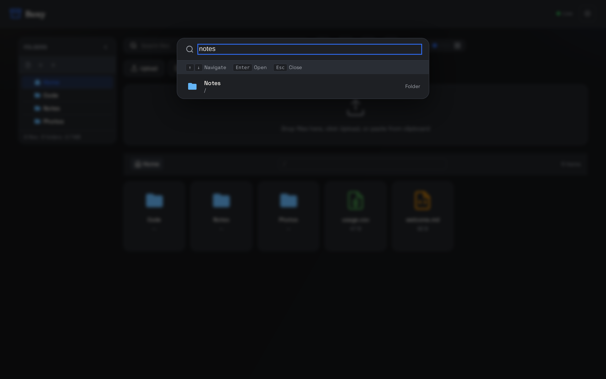
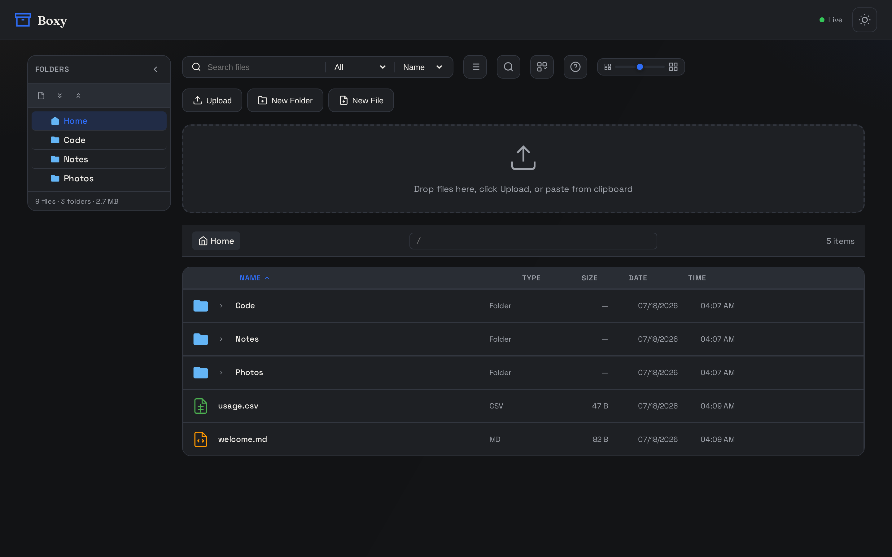

## Global search

Press <kbd>/</kbd> (or <kbd>Ctrl/⌘ F</kbd>) anywhere to open global search. It matches
file and folder **names**, case-insensitively, recursively from the root, and returns up
to 100 results with their full paths.

<Frame caption="Global search overlays the app — arrow keys navigate, Enter opens">
  
</Frame>

The same search over the API:

```bash
curl -s "https://api.boxy.bjk.ai/api/search?q=notes"
# [{"name":"Notes","path":"Notes","is_dir":true,"size":4096,"modified":1784362035}]
```

## Per-folder filtering

Within a folder you can narrow the listing without a server round-trip:

- **Name filter** — live substring filter box in the toolbar.
- **Type filter** — Images, Documents, Code, or Audio/Video.
- **Per-column filters (list view)** — Excel-style dropdowns on the Name, Type, and Date
  columns, with a Clear option.

## List view

<Frame caption="List view — sortable columns, separate Date and Time, per-column filters, folders always first">
  
</Frame>

Click the Name, Type, Size, Date, or Time headers to sort; direction toggles on repeat
clicks. Single-click a folder row to **inline-expand** its contents. The **zoom slider**
in the toolbar resizes grid cards (80–200 px) or adjusts list row density. All view
preferences persist per browser.

## Getting around

| Mechanism | Details |
|-----------|---------|
| Sidebar tree | Collapsible folder tree; drop files on a folder to move them; expand/collapse-all buttons; optional file display |
| Breadcrumbs | Click any ancestor to jump up |
| Path bar | Editable address input — type a path, press <kbd>Enter</kbd> |
| URL hash | The current folder lives in the URL, so deep links and refresh both work |
| Keyboard | Arrow keys move focus, <kbd>Enter</kbd> opens, <kbd>Backspace</kbd> goes to the parent folder |
