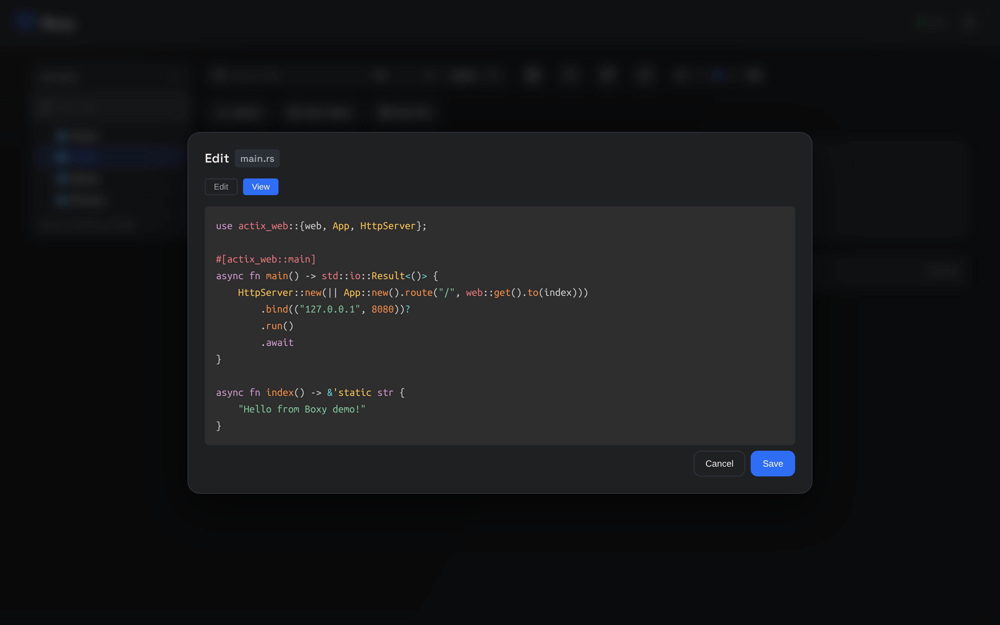
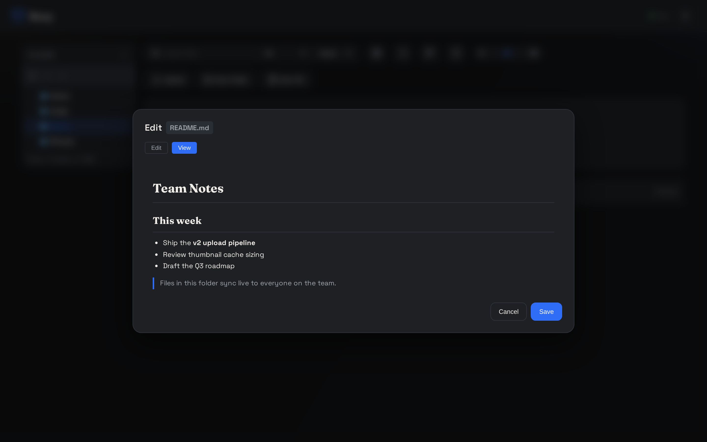

Boxy includes an in-browser editor for text files. Open any editable file via the context
menu (or use **New file** to create one) and edit it in place — no download/re-upload
round-trip.

<Frame caption="View mode renders code with Prism.js syntax highlighting — fully offline, no CDN">
  
</Frame>

## Editable file types

```
txt csv py json md rs js ts html css toml yaml yml sql m3u sh go rb php xml
```

Files with other extensions are download/preview-only.

## Markdown preview

`.md` files render to formatted HTML in view mode; toggle to **Edit** for the raw text:

<Frame caption="Rendered Markdown preview (marked.js, vendored)">
  
</Frame>

## Autosave

While editing, changes save automatically after a **2-second** pause in typing.
<kbd>Ctrl/⌘ S</kbd> saves immediately. Every save broadcasts an `edit` event over the
WebSocket, so other clients viewing the same folder refresh instantly.

## The content API

Read any editable file as raw text:

<EndpointRequestSnippet endpoint="GET /api/content" />

Save it back:

<EndpointRequestSnippet endpoint="POST /api/content" />

Create an empty file:

<Tabs>
  <Tab title="cURL" language="curl">
    ```bash
    curl -s -X POST https://api.boxy.bjk.ai/api/newfile \
      -H "Content-Type: application/json" \
      -d '{"filename": "todo.md", "path": "docs"}'
    # {"success":true,"path":"docs/todo.md"}
    ```
  </Tab>
  <Tab title="Python" language="python">
    ```python
    import requests

    r = requests.post(
        "https://api.boxy.bjk.ai/api/newfile",
        json={"filename": "todo.md", "path": "docs"},
    )
    print(r.json())  # {"success": True, "path": "docs/todo.md"}
    ```
  </Tab>
</Tabs>

<Tip>
**Duplicate** any file or folder from the context menu — copies get de-duplicated names
(`name_1`, `name_2`, …).
</Tip>
