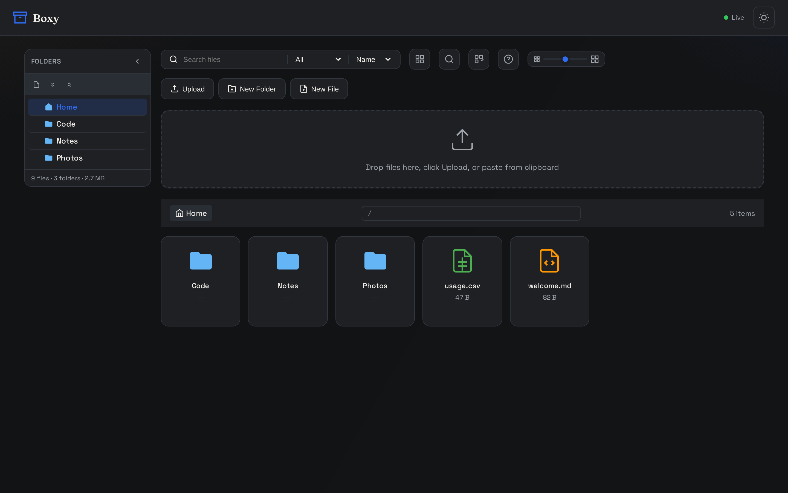
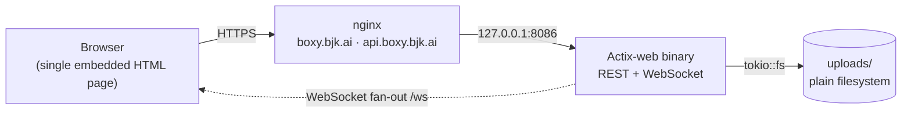

**Boxy** is a self-hosted file sharing web app: a real-time file manager with drag-and-drop
uploads, folders, an in-browser text editor, and live updates across every connected client —
all served by **one Rust binary** that embeds its entire frontend. No database, no frontend
build step, no runtime CDN dependency.

<Frame caption="The Boxy home screen — sidebar folder tree, drop zone, live path bar, and storage totals">
  
</Frame>

## Get started

<CardGroup cols={2}>
  <Card title="Quickstart" icon="fa-solid fa-bolt" href="/documentation/getting-started/quickstart">
    Upload your first file and make your first API call in under a minute.
  </Card>
  <Card title="Installation" icon="fa-solid fa-download" href="/documentation/getting-started/installation">
    Build from source with Cargo or run with Docker.
  </Card>
  <Card title="Configuration" icon="fa-solid fa-sliders" href="/documentation/getting-started/configuration">
    Every setting is an environment variable with a sensible default.
  </Card>
  <Card title="API Reference" icon="fa-solid fa-code" href="/api-reference">
    Every REST endpoint at `api.boxy.bjk.ai`, generated from the OpenAPI spec.
  </Card>
</CardGroup>

## Features

<CardGroup cols={3}>
  <Card title="File management" icon="fa-solid fa-folder-open" href="/documentation/using-boxy/file-management">
    Drag-and-drop uploads, folders, clipboard copy/cut/paste, multi-select, ZIP downloads.
  </Card>
  <Card title="Text editor" icon="fa-solid fa-pen-to-square" href="/documentation/using-boxy/text-editor">
    Edit 20 file types in the browser with syntax highlighting and autosave.
  </Card>
  <Card title="Search & navigation" icon="fa-solid fa-magnifying-glass" href="/documentation/using-boxy/search-navigation">
    Global recursive search, per-column filters, grid and list views.
  </Card>
  <Card title="Keyboard shortcuts" icon="fa-solid fa-keyboard" href="/documentation/using-boxy/keyboard-shortcuts">
    Fully keyboard-navigable — press <kbd>?</kbd> in the app.
  </Card>
  <Card title="Real-time updates" icon="fa-solid fa-bolt-lightning" href="/documentation/using-boxy/real-time-updates">
    Every change broadcasts over a WebSocket to all connected clients.
  </Card>
  <Card title="Self-hosting" icon="fa-solid fa-server" href="/documentation/self-hosting/production-deployment">
    systemd + nginx topology, TLS, security model, and releases.
  </Card>
</CardGroup>

## How it works

| Layer | Technology |
|-------|------------|
| Backend | Rust + Actix-web 4, single file (`src/main.rs`) |
| Frontend | Vanilla JS + CSS in one embedded HTML page (`static/index.html`) |
| Real-time | WebSocket fan-out on `/ws` via `tokio::sync::broadcast` |
| Storage | The local `uploads/` directory — no database |
| Theme | Dark-mode-first pure CSS, honours `prefers-reduced-motion` |

<Note>
Boxy is designed to run **localhost-only behind a reverse proxy** — nginx terminates TLS at
`boxy.bjk.ai` (the app) and `api.boxy.bjk.ai` (the same API under a clean host for
integrations). See the [Security Model](/documentation/self-hosting/security-model) before exposing an instance.
</Note>
