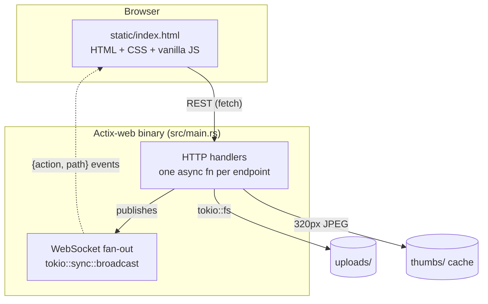

Boxy is deliberately minimal: a single Rust binary serves one embedded HTML page plus a
REST/WebSocket API backed by the local filesystem. There is no database — file state
lives on disk, and per-browser UI preferences live in `localStorage`.



## Components

<AccordionGroup>
<Accordion title="Web UI — static/index.html">
A single ~5,300-line file containing all HTML, CSS, and vanilla JS. It implements the
sidebar folder tree, grid/list browser, drag-and-drop upload/move, context menu, inline
rename, multi-select with bulk ZIP download, search/filter/sort, the text editor with
syntax highlighting and Markdown preview, the image lightbox, and URL hash navigation.
Dark-mode-first theme built on CSS custom-property tokens. Embedded into the binary via
`include_str!` — no build step, no CDN. Prism.js, marked.js, and fonts are vendored
under `static/vendor/`.
</Accordion>
<Accordion title="HTTP API — src/main.rs">
A single ~1,700-line file: one async handler per endpoint, listed in the
[API Reference](/api-reference). All mutating handlers broadcast a WebSocket event after
succeeding. Path safety is centralised in `clean_relative_path` + `resolve_path_safe`
(see [Security Model](/documentation/self-hosting/security-model)).
</Accordion>
<Accordion title="WebSocket fan-out — /ws">
Each client subscribes to a `tokio::sync::broadcast` channel. Every mutation publishes
`{ action, path }` to all subscribers. Lagged clients are logged, not silently dropped.
The frontend reconnects with exponential backoff.
</Accordion>
<Accordion title="Storage — uploads/">
`tokio::fs` reads and writes under the upload root. Filenames are de-duplicated
server-side (`name`, `name_1`, …, then a UUID fallback). Image thumbnails (320 px JPEG)
are cached in a separate directory (`BOX_THUMB_DIR`) outside the upload root.
</Accordion>
</AccordionGroup>

## Design choices

| Choice | Why |
|--------|-----|
| Single binary, embedded frontend | Deploy = copy one file; dev loop = `cargo run`; nothing to CDN |
| No database | The filesystem *is* the state; `localStorage` holds per-browser preferences |
| Vendored JS/fonts | Fully offline-capable; no supply-chain surprises at runtime |
| Localhost bind + reverse proxy | TLS and access control live in one battle-tested place (nginx) |
| Broadcast-everything real-time | One channel, one message shape — clients decide what to refresh |

## Repository layout

```text
boxy/
├── src/
│   └── main.rs            # entire backend
├── static/
│   ├── index.html         # entire frontend
│   └── vendor/            # Prism.js, marked.js, fonts
├── fern/                  # this documentation site
├── docs/                  # internal docs
├── scripts/               # bump-version.sh, deploy.sh
├── tests/                 # Playwright e2e suite
├── Cargo.toml
├── Dockerfile
└── docker-compose.yml
```

| Path | Role |
|------|------|
| `src/main.rs` | The entire backend |
| `static/index.html` | The entire frontend |
| `static/vendor/` | Prism.js, marked.js, fonts (offline) |
| `fern/` | This documentation site |
| `docs/` | Internal docs: architecture, deployment, testing, audits |
| `scripts/` | `bump-version.sh`, `deploy.sh` |
| `tests/` | Playwright e2e suite |
