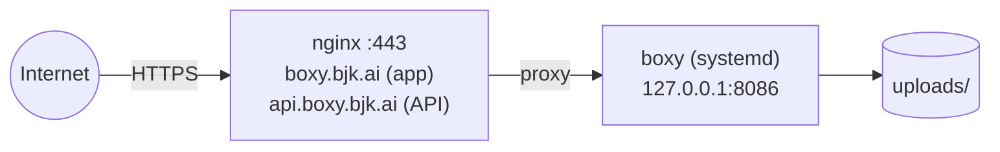

The reference production topology runs Boxy as a **systemd service bound to localhost**,
with nginx in front terminating TLS. The app never binds a public interface directly.
This is exactly how `boxy.bjk.ai` runs.



<Tip>
Serving the API under its own hostname (`api.boxy.bjk.ai`) is just a second nginx vhost
proxying to the same port — handy for integrations, CORS-free tooling, and clean docs.
</Tip>

## The build-and-restart loop

The frontend is embedded into the binary at compile time, so **any** change — backend or
frontend — requires a rebuild and restart:

<Steps>
### Build

```bash
cargo build --release
```

Keep a rollback copy first: `cp target/release/boxy target/release/boxy.bak`

### Restart

```bash
sudo systemctl restart boxy
systemctl is-active boxy
```

### Verify

```bash
curl -s http://127.0.0.1:8086/api/health     # {"ok":true}
curl -s https://api.boxy.bjk.ai/api/health   # {"ok":true} through nginx
```
</Steps>

## systemd unit

`/etc/systemd/system/boxy.service` runs the release binary with the repo as its working
directory. Configure via `Environment=` lines — see [Configuration](/documentation/getting-started/configuration) for
all variables.

```bash
systemctl status boxy
journalctl -u boxy -n 50 --no-pager
```

## nginx site

The site config proxies to the localhost port and must handle WebSockets:

```nginx title="/etc/nginx/sites-available/boxy" {17-19}
server {
    listen 443 ssl http2;
    server_name boxy.example.com;

    ssl_certificate     /etc/letsencrypt/live/example.com/fullchain.pem;
    ssl_certificate_key /etc/letsencrypt/live/example.com/privkey.pem;

    client_max_body_size 500M;

    location / {
        proxy_pass http://127.0.0.1:8086;
        proxy_set_header Host $host;
        proxy_set_header X-Real-IP $remote_addr;
        proxy_set_header X-Forwarded-For $proxy_add_x_forwarded_for;
        proxy_set_header X-Forwarded-Proto $scheme;

        # WebSocket support for /ws — without these, live updates silently fail
        proxy_set_header Upgrade $http_upgrade;
        proxy_set_header Connection "upgrade";
        proxy_read_timeout 86400;
    }
}

server {
    listen 80;
    server_name boxy.example.com;
    return 301 https://$host$request_uri;
}
```

After editing:

```bash
sudo nginx -t && sudo systemctl reload nginx
```

<Warning>
Constraints worth keeping: bind **localhost only** (never expose the app port publicly),
match `client_max_body_size` to your `BOX_MAX_UPLOAD_BYTES`, and remember the WebSocket
upgrade headers.
</Warning>

## Docker alternative

```bash
docker compose up --build
# or
docker build -t boxy . && docker run -p 8086:8086 -v $(pwd)/uploads:/app/uploads boxy
```

Mount `uploads/` as a volume so files persist across container rebuilds.

## Troubleshooting

<AccordionGroup>
  <Accordion title="Live updates stopped working behind the proxy">
    The `/ws` WebSocket needs `Upgrade` and `Connection "upgrade"` headers plus a long
    `proxy_read_timeout` in nginx. Symptoms: uploads work but other tabs don't refresh.
  </Accordion>
  <Accordion title="Large uploads fail with 413">
    Raise nginx `client_max_body_size` — that is the limit that actually rejects
    oversized uploads (the app's `BOX_MAX_UPLOAD_BYTES` is currently not enforced
    app-side).
  </Accordion>
  <Accordion title="UI changes don't show up after deploying">
    The frontend is compiled into the binary. Rebuild (`cargo build --release`) and
    restart the service — there are no separate static files to sync.
  </Accordion>
  <Accordion title="Thumbnails look stale or corrupted">
    Delete the thumbnail cache directory (`BOX_THUMB_DIR`, default `./thumbs`) — it
    repopulates on demand.
  </Accordion>
</AccordionGroup>
